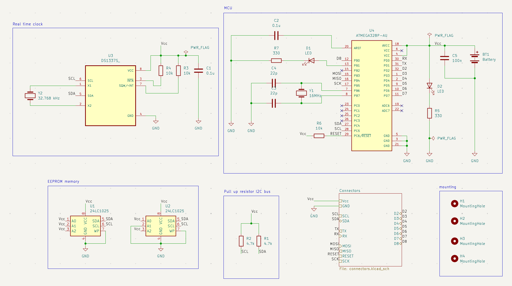
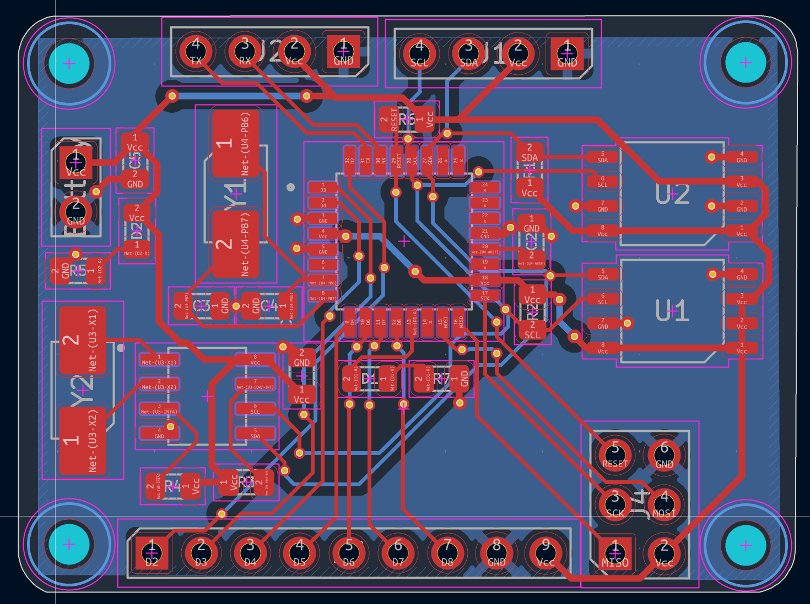
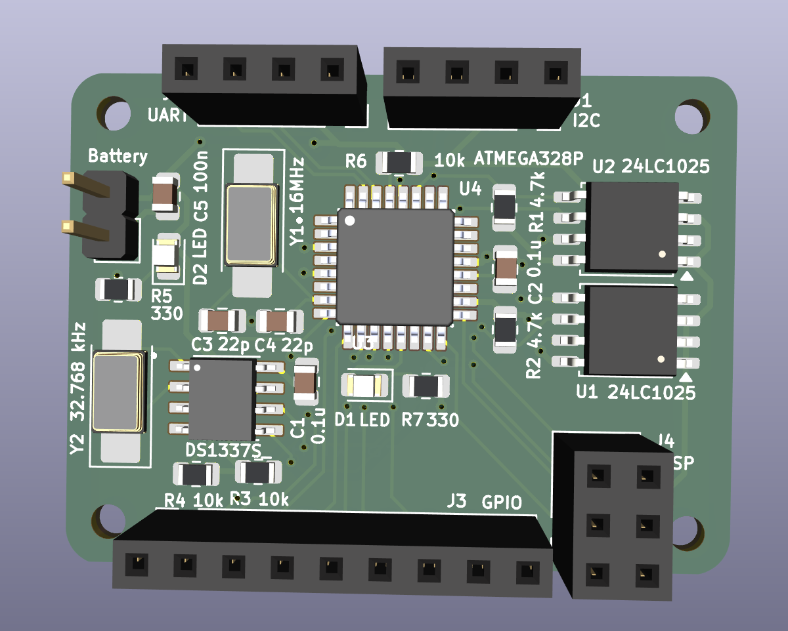
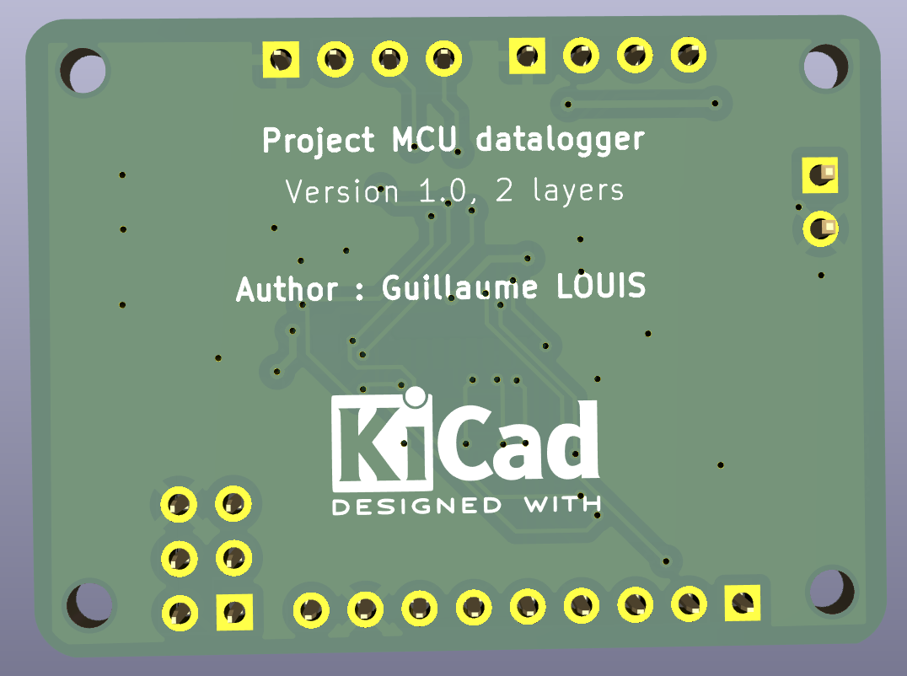

📊 Datalogger MCU Embarqué

Projet créé dans le cadre d'une formation en conception électronique sous KiCad. Ce datalogger est conçu pour enregistrer des données horodatées grâce à une horloge temps réel (RTC) et une mémoire non-volatile (EEPROM).

💡 Description du projet

J'ai réalisé ce projet en complément de mon stage pour approfondir mes compétences en routage PCB et en conception de systèmes embarqués. Le système repose sur un microcontrôleur ATmega328P et intègre les périphériques suivants :
- Microcontrôleur : ATmega328P-AU (Architecture AVR 8-bit).
- Stockage : Mémoire EEPROM I2C (24LC1025) pour la journalisation des données.
- Horloge : RTC (DS1337S) avec sauvegarde pour le suivi temporel.
- Interface : Connecteur ICSP pour la programmation et connecteurs dédiés (I2C, UART, GPIO) pour l'extension.

🛠️ Architecture électronique

Le circuit a été conçu avec une attention particulière sur la gestion du bruit et l'intégrité du signal :
- Routage 2 couches : Utilisation d'un plan de masse solide pour minimiser les interférences électromagnétiques.
- Découplage : Condensateurs placés au plus près des broches d'alimentation du MCU.
- Signalisation : Isolation des lignes sensibles (Quartz 16 MHz) et gestion rigoureuse du bus I2C.

📸 Aperçu du projet

Schema électrique : 

Routage PCB : 

Modèle 3D final : 

